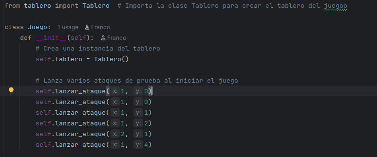
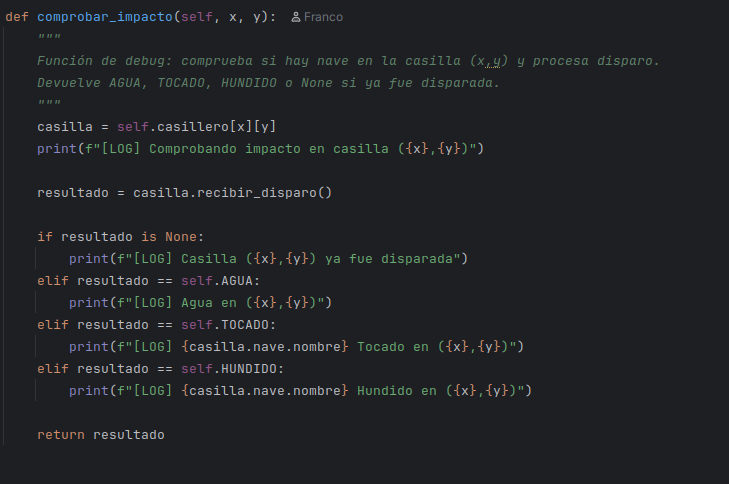
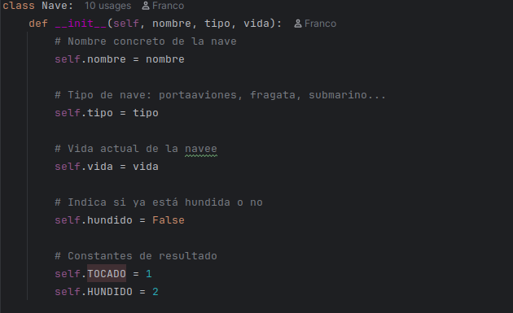
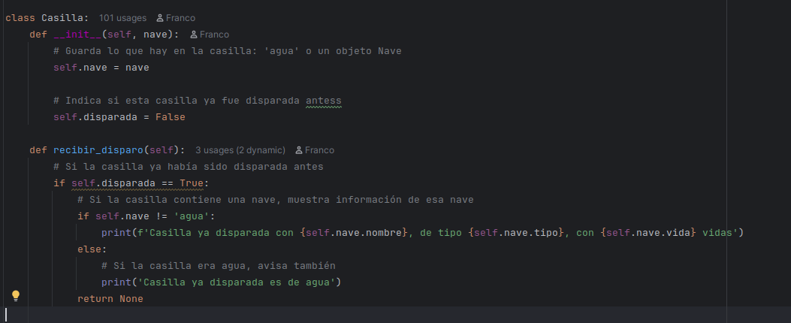
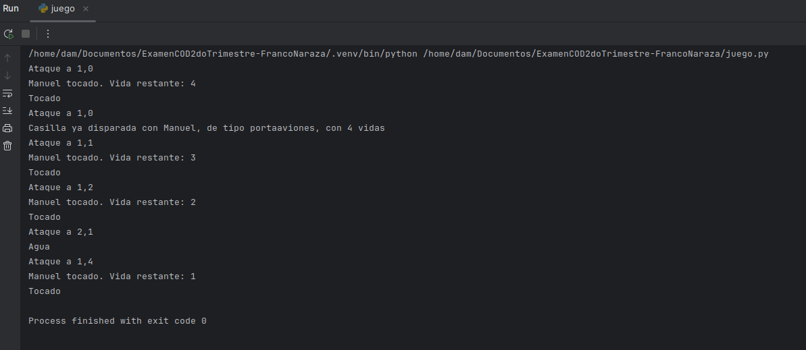

# Explicación del codigo hundir la flota

Tenemos 4 clases principales: Nave, Casilla, Tablero y Juego.
- La clase Nave representa cada barco con su nombre, tamaño, posición y orientación.
- La clase Casilla representa cada celda del tablero, con su estado (vacía, ocupada, impactada).
- La clase Tablero contiene una matriz de Casillas y el método comprobar_impacto para verificar si un ataque impacta una nave.
- La clase Juego maneja el flujo del juego, permitiendo colocar naves y realizar ataques, delegando la lógica de impacto al Tablero.

El código está organizado en archivos separados para cada clase, el flujo de ataque se maneja en la clase Juego, que llama a Tablero para verificar impactos y actualizar el estado del juego.

- La clase Juego es el punto de entrada para iniciar el juego, colocar naves y realizar ataques, mientras que Tablero se encarga de la lógica de impacto y estado del tablero. Casilla y Nave son clases auxiliares para representar el estado de cada celda y cada barco respectivamente.

- la clase tablero tiene un método comprobar_impacto que recibe las coordenadas del ataque y verifica si hay una nave en esa posición. Si hay una nave, marca la casilla como impactada y devuelve True, indicando un impacto exitoso. Si no hay nave, marca la casilla como vacía y devuelve False, indicando un ataque fallido.

- La clase nave tiene atributos como nombre, tamaño, posición y orientación. La posición se representa como una lista de coordenadas que ocupan la nave en el tablero. La orientación puede ser horizontal o vertical, lo que determina cómo se colocan las coordenadas en el tablero.

- La clase casilla es fundamental para representar el estado de cada celda en el tablero y para determinar el resultado de los ataques.

Al ejecutar el juego, se crea una instancia de la clase Juego, se colocan las naves en el tablero y luego se realizan ataques ingresando coordenadas.

